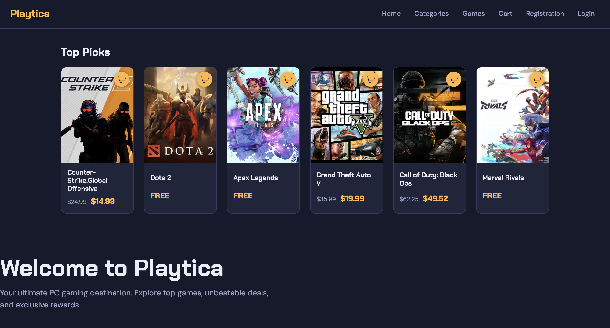
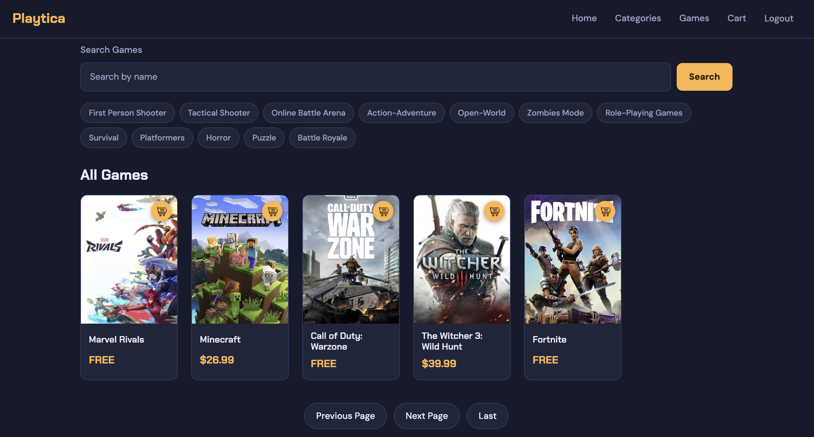
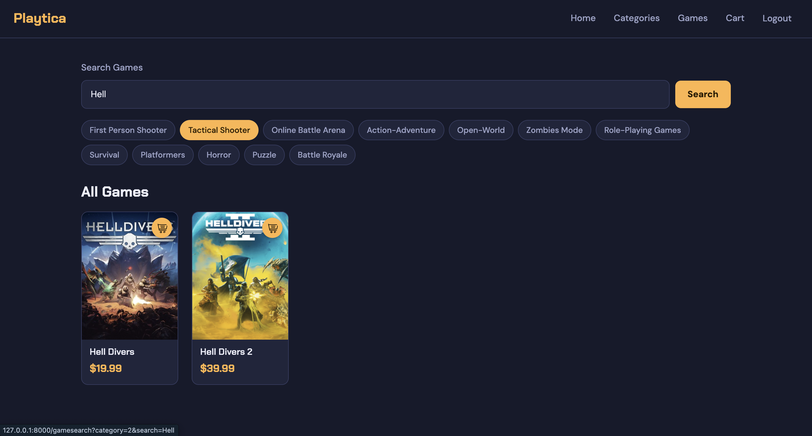
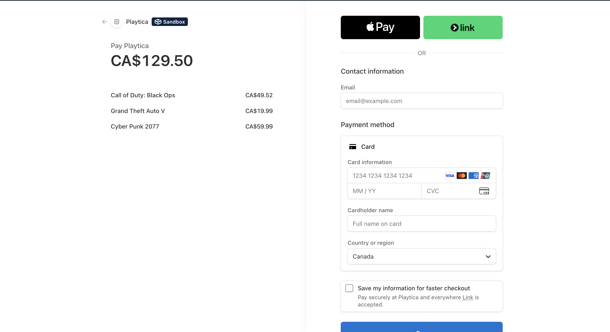

# Playtica

A game storefront built with Django. Users can browse and search a catalogue of PC games, filter by category, add games to a cart, and check out through Stripe (test mode).

## Features

- **User accounts**: registration, login and logout using Django's built-in authentication
- **Game catalogue**: browse all games, search by name, and filter by category, with pagination
- **Game pages**: cover art, release date, description, and sale pricing
- **Shopping cart**: add and remove games; the cart is saved per user in the database
- **Stripe checkout**: charges the real cart contents, and the cart is only cleared after Stripe confirms the payment
- **Admin panel**: manage games, categories and carts through Django admin


## Tech stack

- Python 3.12+
- Django 6
- SQLite
- Stripe Checkout
- HTML and CSS (Django templates)

## Running it locally

**1. Clone the repo and enter the folder**

```bash
git clone https://github.com/dmitry-milyutin/game-store.git
cd Game Store
```

**2. Create and activate a virtual environment**

```bash
python3 -m venv venv
source venv/bin/activate        # macOS / Linux
venv\Scripts\activate           # Windows
```

**3. Install dependencies**

```bash
python -m pip install -r req.txt
```

**4. Create a `.env` file** in the project root (next to `manage.py`):

```
SECRET_KEY=your-django-secret-key
DEBUG=True
STRIPE_SECRET_KEY=sk_test_your_stripe_key
STRIPE_PUBLIC_KEY=pk_test_your_stripe_key
```

Generate a Django secret key with:

```bash
python -c "from django.core.management.utils import get_random_secret_key; print(get_random_secret_key())"
```

Stripe test keys are available for free from the [Stripe dashboard](https://dashboard.stripe.com/test/apikeys) under Developers → API keys.

**5. Set up the database and load the sample games**

```bash
python manage.py migrate
python manage.py loaddata sample_data
python manage.py createsuperuser
```

**6. Run the server**

```bash
python manage.py runserver
```

Open http://127.0.0.1:8000 in your browser. The admin panel is at http://127.0.0.1:8000/admin.

## Testing a payment

Stripe runs in test mode, so no real money is charged. At checkout, use the test card:

- Card number: `4242 4242 4242 4242`
- Expiry: any future date
- CVC: any 3 digits

## Project structure

```
config/          Django project settings and URL routes
game/            Main app: models, views, forms, migrations
game/fixtures/   Sample games and categories
templates/       HTML templates
static/          CSS and icons
media/           Game cover images
```








